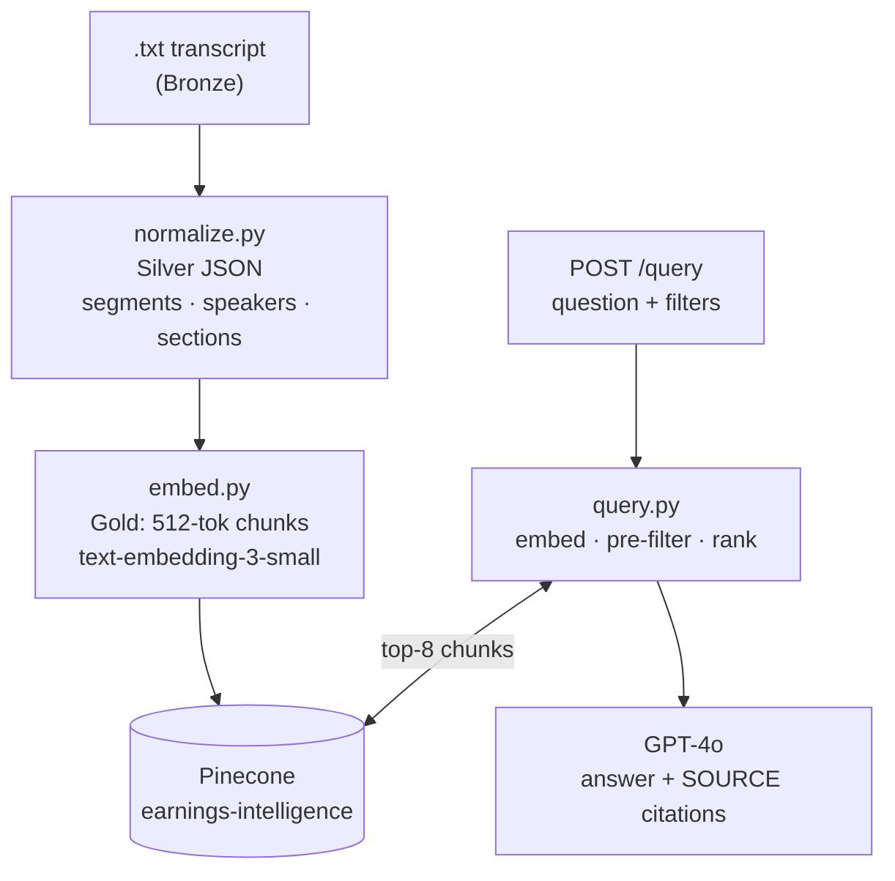

# earnings-intelligence

RAG pipeline for querying earnings call transcripts — normalize raw `.txt` files into structured segments, embed into Pinecone, and ask natural-language questions answered by GPT-4o with inline source citations.

## Architecture



| Layer  | Location             | Contents                                    |
|--------|----------------------|---------------------------------------------|
| Bronze | `data/samples/*.txt` | Raw Motley Fool transcript files            |
| Silver | in-memory            | Normalized JSON — segments, metadata        |
| Gold   | Pinecone index       | 1536-dim embeddings with full metadata      |

## Quickstart

### Local

```bash
git clone <repo> && cd earnings-intelligence
pip install -r requirements.txt
```

Create `.env` in the repo root:

```
OPENAI_API_KEY=sk-...
PINECONE_API_KEY=pcsk_...
PINECONE_INDEX=earnings-intelligence
```

Ingest a transcript and start the server:

```bash
python ingestion/ingest_upload.py data/samples/aapl_q1_2026.txt AAPL
uvicorn api.main:app --reload --port 8000
# Docs at http://localhost:8000/docs  ·  UI at http://localhost:8000/demo
```

Query from the CLI without starting the server:

```bash
python query/query.py --question "What did the CFO say about gross margin?" --ticker AAPL
python query/query.py --question "What questions did analysts ask about AI?" --section qa
```

### Railway

1. Connect the repo to a new Railway project.
2. Add env vars: `OPENAI_API_KEY`, `PINECONE_API_KEY`, `PINECONE_INDEX`.
3. Set start command: `uvicorn api.main:app --host 0.0.0.0 --port $PORT`.
4. Confirm with `GET /health` → `{"status": "ok"}`.

## API Endpoints

| Method | Path       | Description                                                         |
|--------|------------|---------------------------------------------------------------------|
| GET    | `/`        | Service info and endpoint index                                     |
| GET    | `/health`  | Liveness — always 200 if the process is running                     |
| GET    | `/ready`   | Readiness — 503 if any required env var is missing                  |
| GET    | `/demo`    | Interactive HTML UI                                                 |
| POST   | `/ingest`  | Multipart `.txt` + `ticker` [+ `force`] → normalize → embed → upsert |
| POST   | `/query`   | JSON question + optional filters → GPT-4o answer with citations     |
| GET    | `/metrics` | Aggregate query stats (confidence breakdown, avg latency, etc.)     |

**`POST /query` filters** (all optional): `ticker`, `quarter` (e.g. `"Q1 2026"`), `role` (`CEO` | `CFO` | `Analyst`), `section` (`prepared_remarks` | `qa`).

Rate limit: 30 req / 60 s per client IP. `/health` and `/ready` are exempt.

## RAG Pipeline

**Bronze → Silver** (`normalize.py`): The raw `.txt` file is parsed into a structured JSON document. Speakers are identified from the `Call participants` block and from operator introduction lines (`"Our next question is from NAME of FIRM"`). Each segment gets a `speaker`, `role`, `firm`, and `section` tag (`prepared_remarks` or `qa`). Everything before `"Full Conference Call Transcript"` is used for metadata extraction only and is never embedded.

**Silver → Gold** (`embed.py`): Segments under 80 tokens are folded into the next. The remainder is chunked with a 512-token sliding window and 50-token overlap, embedded with `text-embedding-3-small`, and upserted to Pinecone with full metadata (`ticker`, `quarter`, `speaker`, `role`, `firm`, `section`, `chunk_index`, and chunk text). `None` values are coerced to `""` / `0` — Pinecone rejects null metadata.

**Query** (`query.py`): The question is embedded with the same model. Pinecone runs the metadata pre-filter (exact-match on any provided filters) *before* ANN ranking, so filters never degrade retrieval quality. The top-8 chunks are assembled into a `[SOURCE N]`-labeled context block and passed to GPT-4o (`temp=0.1`). The model is instructed to answer strictly from excerpts, cite sources inline, and append a `{"found": bool, "confidence": "high"|"medium"|"low"}` JSON block.

**Dedup**: `ingest_upload.py` queries Pinecone with a zero vector + `transcript_id` filter before calling OpenAI. If hits exist and `--force` is not set, the ingest is skipped. Re-ingesting with `--force` is idempotent — chunk IDs are deterministic (`AAPL_Q1_2026_seg3_c0`), so Pinecone upserts overwrite in place.

## Tests

```bash
pytest tests/ -v    # 79 tests — Pinecone and OpenAI fully mocked
```
